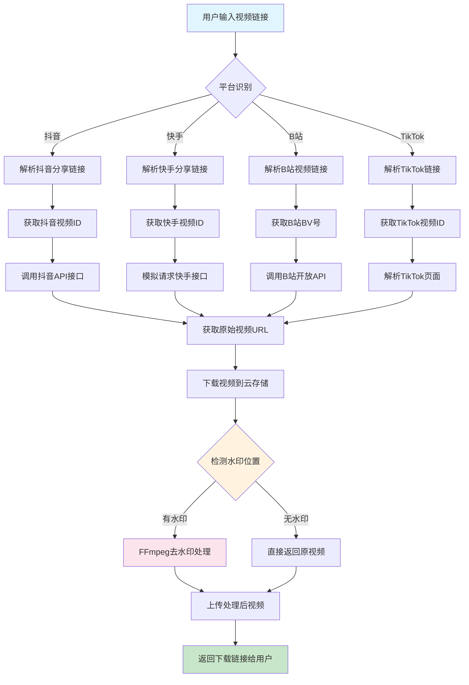

# CoralPure 珊瑚去水印 - 技术方案分析

## 📋 项目需求分析
- **目标平台**：抖音/快手/B站/TikTok
- **技术约束**：微信云开发环境、禁止商用API、优先开源方案
- **核心功能**：短视频链接解析 + 水印去除 + 文件下载

---

## 🔍 技术选型对比表

| 技术方案 | 抖音 | 快手 | B站 | TikTok | 微信云兼容性 | 开发难度 | 合规风险 |
|---------|------|------|-----|--------|-------------|----------|----------|
| **前端解析** | ❌ | ❌ | ❌ | ❌ | ✅ | 低 | 高 |
| **Node.js爬虫** | ⚠️ | ⚠️ | ✅ | ⚠️ | ✅ | 中 | 高 |
| **Python后端** | ✅ | ✅ | ✅ | ✅ | ❌ | 高 | 中 |
| **FFmpeg处理** | ✅ | ✅ | ✅ | ✅ | ⚠️ | 中 | 低 |
| **OpenCV算法** | ✅ | ✅ | ✅ | ✅ | ❌ | 高 | 低 |

### 推荐方案组合
**微信云开发 + Node.js + FFmpeg**
- ✅ 完全兼容微信云环境
- ✅ 无需商用API
- ✅ 开源技术栈
- ⚠️ 需要自建解析逻辑

---

## 🔄 关键算法流程图



---

## ⚠️ 合规风险说明

### 🔴 高风险项目
1. **版权侵权风险**
   - 去除水印可能涉及版权保护绕过
   - 建议：添加版权声明，仅供个人学习使用

2. **平台反爬虫机制**
   - 各平台都有反爬虫策略
   - 风险：IP封禁、接口限制
   - 建议：添加请求频率限制、IP轮换

3. **用户协议违反**
   - 可能违反各平台用户服务协议
   - 建议：明确告知用户风险

### 🟡 中等风险项目
1. **数据存储合规**
   - 临时存储用户视频文件
   - 建议：设置自动清理机制（24小时）

2. **用户隐私保护**
   - 避免记录用户操作日志
   - 建议：匿名化处理

### 🟢 低风险项目
1. **技术实现**
   - 使用开源FFmpeg库
   - 纯技术处理，无商业化

---

## 🛡️ 免责声明

### 重要提醒
1. **本工具仅供技术学习和研究使用**
2. **用户需自行承担使用风险和法律责任**
3. **严禁用于商业用途或侵犯他人版权**
4. **建议用户在使用前获得原作者授权**

### 开发者声明
- 本项目为开源技术演示
- 不承担任何法律责任
- 如有侵权请联系删除

---

## 📝 技术实现建议

### 1. 微信云开发架构
```
小程序前端 → 云函数 → 云存储
     ↓         ↓        ↓
   用户界面   业务逻辑   文件处理
```

### 2. 核心模块划分
- **链接解析模块**：识别和解析各平台链接
- **视频下载模块**：获取原始视频文件
- **水印处理模块**：基于FFmpeg的水印去除
- **文件管理模块**：云存储的上传下载管理

### 3. 开发优先级
1. **Phase 1**：B站解析（API相对稳定）
2. **Phase 2**：抖音解析（需要逆向分析）
3. **Phase 3**：快手和TikTok解析
4. **Phase 4**：水印检测和去除算法优化

---

## 🔧 下一步行动计划

1. **环境搭建**：配置微信云开发环境
2. **原型开发**：先实现B站视频解析功能
3. **算法集成**：集成FFmpeg水印处理
4. **测试验证**：小范围功能测试
5. **合规审查**：法律风险评估
6. **用户界面**：小程序前端开发

---

*最后更新时间：2025年1月*